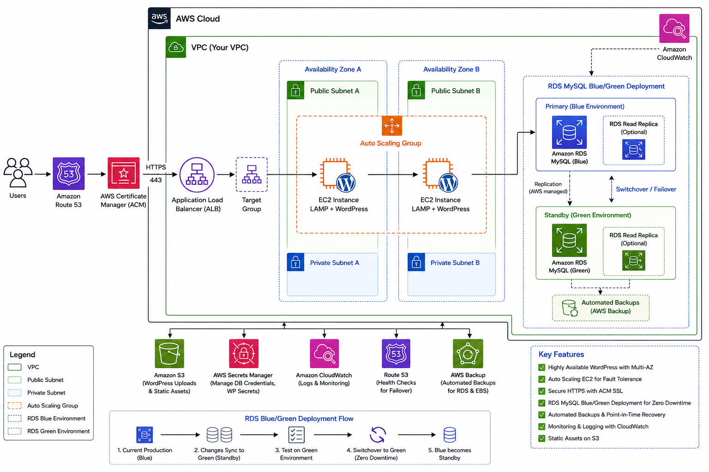
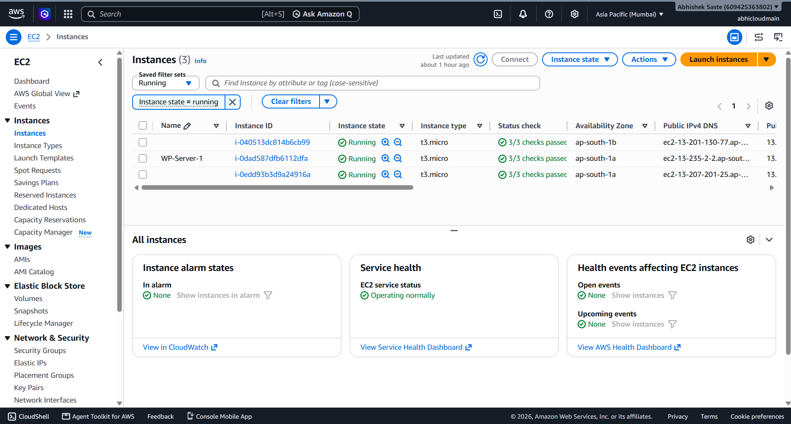
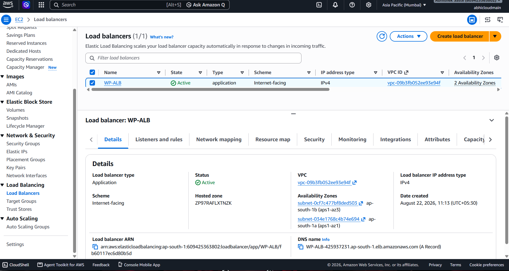
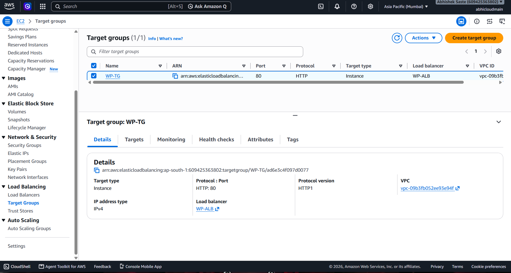
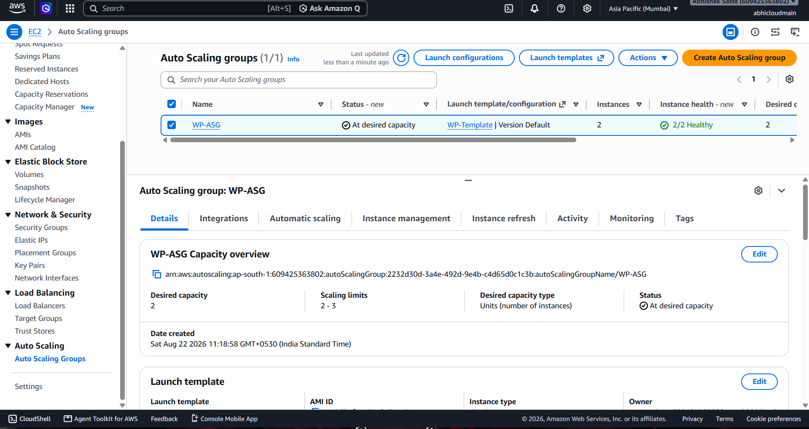
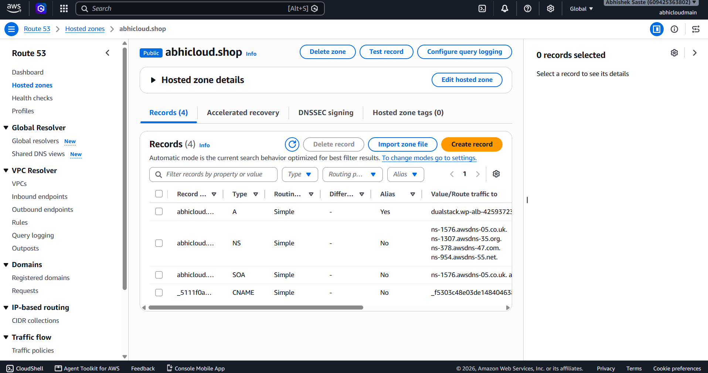
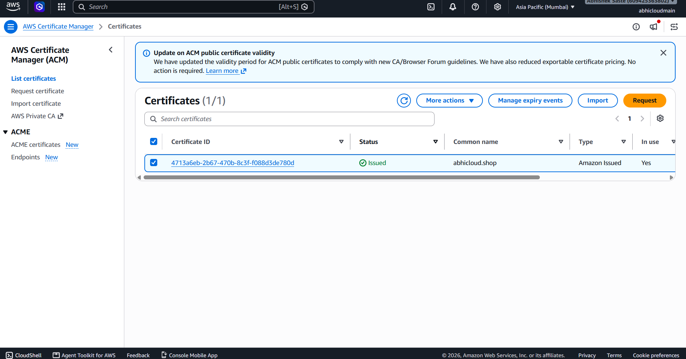
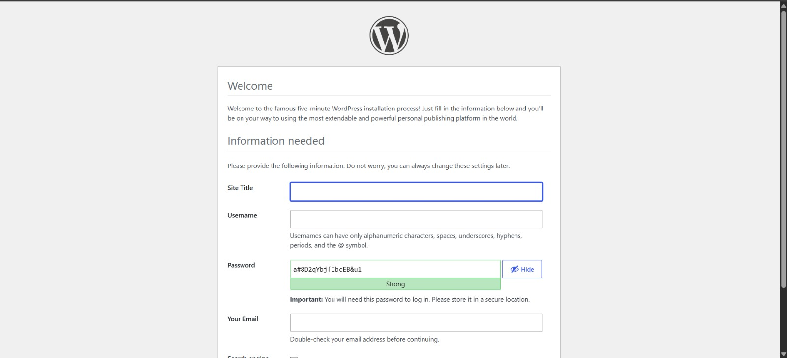

# 🚀 AWS WordPress High Availability

## 📌 Project Overview

This project demonstrates a highly available and scalable WordPress website deployed on AWS using a **LAMP stack** and multiple AWS services.

The application layer runs on Amazon EC2 instances, traffic is distributed using an Application Load Balancer, and EC2 instances are managed by an Auto Scaling Group.

The WordPress database is hosted on **Amazon RDS for MySQL**. **RDS Blue/Green Deployment** was also implemented to demonstrate safer database deployment and switchover.

---

## 🏗️ AWS Architecture



### Architecture Flow

```text
Internet Users
      ↓
Amazon Route 53
      ↓
ACM SSL Certificate
      ↓
HTTPS
      ↓
Application Load Balancer
      ↓
Target Group
      ↓
Auto Scaling Group
      ↓
Multiple EC2 Instances
      ↓
LAMP Stack + WordPress
      ↓
Amazon RDS MySQL
```

---

## ☁️ AWS Services Used

| Service                   | Purpose                             |
| ------------------------- | ----------------------------------- |
| Amazon EC2                | Hosts WordPress application         |
| Apache                    | Web server                          |
| PHP                       | WordPress runtime                   |
| Amazon RDS MySQL          | Managed WordPress database          |
| Application Load Balancer | Distributes incoming traffic        |
| Target Group              | EC2 registration and health checks  |
| Auto Scaling Group        | Automatically manages EC2 instances |
| Amazon Route 53           | DNS management                      |
| AWS Certificate Manager   | SSL/TLS certificate                 |
| Security Groups           | Network access control              |

---

## 🖥️ LAMP Stack

The WordPress application is deployed using the LAMP stack:

```text
Linux
  ↓
Apache
  ↓
PHP
  ↓
WordPress
  ↓
Amazon RDS MySQL
```

### Components

* **Linux** — Operating system
* **Apache** — Web server
* **PHP** — WordPress runtime
* **MySQL** — Database engine
* **WordPress** — Web application

---

## ⚖️ Application Load Balancer

The Application Load Balancer receives incoming HTTPS requests and distributes traffic across healthy EC2 instances registered in the Target Group.

```text
                Application Load Balancer
                         |
                    Target Group
                    /           \
                   ↓             ↓
                EC2-1          EC2-2
             WordPress       WordPress
```

### Target Group

The Target Group performs health checks and sends traffic only to healthy EC2 instances.

---

## 📈 Auto Scaling Group

The Auto Scaling Group manages the EC2 application instances.

It provides scalability by allowing EC2 instances to be launched or terminated according to the configured scaling policy.

```text
                Auto Scaling Group
                       |
          ┌────────────┼────────────┐
          ↓            ↓            ↓
        EC2-1        EC2-2        EC2-3
      WordPress     WordPress     WordPress
```

### Benefits

* Automatic scaling
* Improved availability
* Fault tolerance
* Better traffic handling

---

## 🔄 RDS Blue/Green Deployment

RDS Blue/Green Deployment was implemented to demonstrate a safer database deployment strategy.

```text
Blue Environment
       ↓
Replication
       ↓
Green Environment
       ↓
Testing & Validation
       ↓
Switchover
       ↓
New Production Environment
```

### Blue Environment

The Blue environment represents the current production database.

### Green Environment

The Green environment is used to prepare and validate the new database environment before production switchover.

### Switchover

After successful testing and validation, the Green environment can become the production environment.

### Documentation

[RDS Blue/Green Deployment Documentation](rds/rds-blue-green-deployment.md)

## 📸 Project Screenshots

### 🖥️ EC2 Instances



### ⚖️ Application Load Balancer



### 🎯 Target Group



### 📈 Auto Scaling Group



### 🗄️ Amazon RDS MySQL


### 🌐 Route 53



### 🔐 AWS Certificate Manager



### 🌍 WordPress Website



## 🌐 Route 53

Amazon Route 53 is used for DNS management and routing the domain to the Application Load Balancer.

```text
Domain
  ↓
Route 53
  ↓
Application Load Balancer
```

---

## 🔐 HTTPS with ACM

AWS Certificate Manager is used to provide the SSL/TLS certificate for HTTPS.

```text
User
 ↓
HTTPS :443
 ↓
Application Load Balancer
 ↓
EC2
```

This secures communication between the client and the load balancer.

---

## 🔒 Security

Security Groups were configured to control communication between the different layers.

```text
Internet
   ↓
ALB
   ↓
EC2
   ↓
RDS
```

The database layer is separated from the public application entry point.

### Security Best Practices

* Do not expose RDS directly to the internet.
* Allow database access only from the application layer.
* Use HTTPS for website traffic.
* Never commit credentials to GitHub.
* Never upload `.pem` private keys.
* Never upload AWS Access Keys or Secret Keys.

---

## 🧪 Testing

The infrastructure was tested using:

* WordPress website access
* HTTPS connectivity
* Route 53 DNS resolution
* Application Load Balancer
* Target Group health checks
* EC2 instances
* RDS MySQL connectivity
* Auto Scaling configuration
* RDS Blue/Green Deployment

---

## 📸 Project Screenshots

Project screenshots are available in the [`screenshots`](screenshots/) directory.

Important screenshots include:

* EC2 Instances
* Application Load Balancer
* Target Group
* Auto Scaling Group
* Amazon RDS
* RDS Blue/Green Deployment
* Route 53
* ACM Certificate
* WordPress Website

---

## 📂 Project Structure

```text
AWS-Wordpress-high-availability/
│
├── README.md
│
├── architecture/
│   ├── README.md
│   └── aws-wordpress-architecture.png
│
├── wordpress/
│   └── README.md
│
├── lamp-stack/
│   └── README.md
│
├── ec2/
│   └── README.md
│
├── alb/
│   └── README.md
│
├── autoscaling/
│   └── README.md
│
├── rds/
│   ├── README.md
│   └── rds-blue-green-deployment.md
│
├── route53/
│   └── README.md
│
├── acm/
│   └── README.md
│
├── screenshots/
│   ├── README.md
│   └── rds-blue-green.png
│
└── docs/
    └── README.md
```

---

## 🎯 Key Features

* ✅ WordPress on Amazon EC2
* ✅ LAMP stack
* ✅ Amazon RDS MySQL
* ✅ Application Load Balancer
* ✅ Target Group
* ✅ Auto Scaling Group
* ✅ Route 53 DNS
* ✅ ACM SSL/TLS
* ✅ HTTPS
* ✅ RDS Blue/Green Deployment
* ✅ Scalable architecture
* ✅ Highly available application layer
* ✅ Managed database architecture

---

## 📚 Learning Outcomes

Through this project, I gained practical experience with:

* AWS EC2
* LAMP stack
* WordPress deployment
* Amazon RDS
* RDS Blue/Green Deployment
* Application Load Balancer
* Target Groups
* Auto Scaling Groups
* Route 53
* AWS Certificate Manager
* HTTPS
* Security Groups
* AWS networking
* High availability
* Cloud infrastructure architecture

---

## 👨‍💻 Author

**Abhishek Saste**

Cloud & DevOps Enthusiast

GitHub: [abhisheksaste31-source](https://github.com/abhisheksaste31-source)

---

## ⭐ Project

If you find this project useful, consider giving this repository a ⭐ star.


