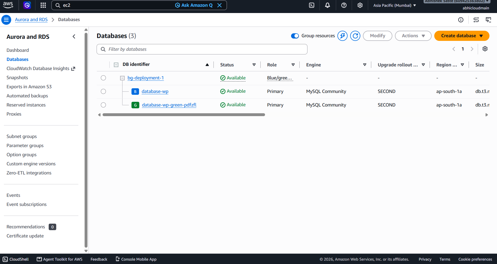

# 🚀 AWS WordPress High Availability

A highly available and scalable WordPress website hosted on AWS using a **LAMP stack**, **Amazon EC2**, **Amazon RDS for MySQL**, **Application Load Balancer**, **Target Group**, **Auto Scaling Group**, **Amazon Route 53**, and **AWS Certificate Manager (ACM)**.

---

## 📌 Project Overview

This project demonstrates a production-style WordPress deployment on AWS with:

* High availability
* Load balancing
* Auto scaling
* Managed MySQL database
* DNS management
* HTTPS/SSL
* RDS Blue/Green Deployment

The WordPress application runs on Amazon EC2 instances using the LAMP stack, while the production database is hosted on Amazon RDS for MySQL.

Application traffic is distributed through an Application Load Balancer, and EC2 instances are managed by an Auto Scaling Group.

---

## 🏗️ AWS Architecture


### Architecture Flow

```text
Internet Users
      ↓
Amazon Route 53
      ↓
AWS Certificate Manager
      ↓
HTTPS :443
      ↓
Application Load Balancer
      ↓
Target Group
      ↓
Auto Scaling Group
      ↓
Multiple EC2 Instances
      ↓
LAMP Stack + WordPress
      ↓
Amazon RDS MySQL
```

---

## ☁️ AWS Services Used

| AWS Service               | Purpose                                            |
| ------------------------- | -------------------------------------------------- |
| Amazon EC2                | Hosts the WordPress application                    |
| Apache                    | Web server                                         |
| PHP                       | WordPress runtime                                  |
| Amazon RDS for MySQL      | Managed WordPress database                         |
| Application Load Balancer | Distributes incoming traffic                       |
| Target Group              | Registers EC2 instances and performs health checks |
| Auto Scaling Group        | Automatically manages EC2 instances                |
| Amazon Route 53           | DNS management                                     |
| AWS Certificate Manager   | SSL/TLS certificate                                |
| Security Groups           | Controls network access                            |

---

## ⚙️ LAMP Stack

The WordPress application uses the LAMP stack:

```text
Linux
  ↓
Apache
  ↓
PHP
  ↓
WordPress
  ↓
Amazon RDS MySQL
```

### Components

* **Linux** — Operating system
* **Apache** — Web server
* **MySQL** — Database engine
* **PHP** — WordPress runtime
* **WordPress** — Web application

---

## ⚖️ Application Load Balancer

The Application Load Balancer acts as the public entry point for the WordPress application.

It receives incoming requests and distributes traffic across healthy EC2 instances registered in the Target Group.

```text
Internet Users
      ↓
Application Load Balancer
      ↓
Target Group
    /     \
   ↓       ↓
 EC2-1   EC2-2
   ↓       ↓
WordPress WordPress
```

### Target Group

The Target Group performs health checks and sends traffic only to healthy EC2 instances.

```text
ALB
 ↓
Target Group
 ↓
Health Check
 ├── Healthy → Receive Traffic
 └── Unhealthy → No Traffic
```

---

## 📈 Auto Scaling Group

The Auto Scaling Group manages the EC2 application servers.

It can automatically launch or terminate EC2 instances according to the configured scaling policy.

```text
Traffic Increase
      ↓
Auto Scaling Policy
      ↓
Auto Scaling Group
      ↓
New EC2 Instance
      ↓
Target Group
      ↓
Application Load Balancer
```

### Benefits

* Automatic scaling
* Improved availability
* Fault tolerance
* Better handling of traffic increases
* Automatic replacement of unhealthy instances

---

## 🗄️ Amazon RDS MySQL

Amazon RDS for MySQL is used as the managed database layer for WordPress.

The database is separated from the EC2 application layer.

```text
EC2
 ↓
WordPress
 ↓
Amazon RDS
 ↓
MySQL
 ↓
WordPress Database
```

The RDS database is not intended to be directly accessible from the public internet.

Database access is controlled using Security Groups.

---

## 🔄 RDS Blue/Green Deployment

RDS Blue/Green Deployment was implemented to demonstrate a safer database deployment and switchover strategy.

```text
Blue Environment
       ↓
Replication
       ↓
Green Environment
       ↓
Testing & Validation
       ↓
Switchover
       ↓
New Production Environment
```

### 🔵 Blue Environment

The Blue environment represents the current production database.

### 🟢 Green Environment

The Green environment is used to prepare and validate the new database environment before production switchover.

### 🧪 Testing & Validation

Before switchover, the Green environment can be validated for:

* Database connectivity
* Data synchronization
* Database objects
* Application compatibility
* WordPress functionality

### 🔄 Switchover

After successful validation, the Green environment can become the new production environment.

### Detailed Documentation

[RDS Blue/Green Deployment Documentation](rds/rds-blue-green-deployment.md)

---

## 🌐 Route 53

Amazon Route 53 is used for DNS management.

The custom domain is routed to the Application Load Balancer.

```text
Custom Domain
      ↓
Amazon Route 53
      ↓
Application Load Balancer
      ↓
Target Group
      ↓
EC2
      ↓
WordPress
```

---

## 🔐 HTTPS with ACM

AWS Certificate Manager provides the SSL/TLS certificate used for secure HTTPS access.

```text
User
 ↓
HTTPS :443
 ↓
Application Load Balancer
 ↓
Target Group
 ↓
EC2
 ↓
WordPress
```

HTTP traffic can be redirected to HTTPS through the Application Load Balancer.

```text
HTTP :80
   ↓
Redirect
   ↓
HTTPS :443
   ↓
ALB
```

---

## 🔒 Security

Security Groups are used to control communication between the different layers.

```text
Internet
   ↓
ALB
   ↓
EC2
   ↓
RDS
```

The application and database layers are separated.

### Security Best Practices

* Do not expose RDS directly to the internet.
* Allow database access only from the application layer.
* Use HTTPS for website traffic.
* Do not commit AWS credentials.
* Do not upload private `.pem` keys.
* Do not upload database passwords.
* Do not upload secret values or `.env` files containing credentials.

---

## 🧪 Testing

The project was tested using:

* WordPress website access
* Custom domain
* HTTPS connectivity
* Route 53 DNS resolution
* Application Load Balancer
* Target Group health checks
* EC2 instances
* RDS MySQL connectivity
* Auto Scaling configuration
* RDS Blue/Green Deployment

---

## 📸 Project Screenshots

### 🖥️ EC2 Instances


### ⚖️ Application Load Balancer


### 🎯 Target Group


### 📈 Auto Scaling Group


### 🗄️ Amazon RDS MySQL


### 🔄 RDS Blue/Green Deployment



### 🌐 Route 53


### 🔐 AWS Certificate Manager


### 🌍 WordPress Website


---

## 📂 Project Structure

```text
AWS-Wordpress-high-availability/
│
├── README.md
│
├── architecture/
│   ├── README.md
│   └── aws-wordpress-architecture.png
│
├── wordpress/
│   └── README.md
│
├── lamp-stack/
│   └── README.md
│
├── ec2/
│   └── README.md
│
├── alb/
│   └── README.md
│
├── autoscaling/
│   └── README.md
│
├── rds/
│   ├── README.md
│   └── rds-blue-green-deployment.md
│
├── route53/
│   └── README.md
│
├── acm/
│   └── README.md
│
├── screenshots/
│   ├── README.md
│   ├── ec2.png
│   ├── alb.png
│   ├── target-group.png
│   ├── autoscaling.png
│   ├── rds.png
│   ├── rds-blue-green.png
│   ├── route53.png
│   ├── acm.png
│   └── wordpress.png
│
└── docs/
    └── README.md
```

---

## 🎯 Key Features

* ✅ WordPress hosted on Amazon EC2
* ✅ LAMP stack
* ✅ Amazon RDS for MySQL
* ✅ Application Load Balancer
* ✅ Target Group health checks
* ✅ Auto Scaling Group
* ✅ Route 53 DNS
* ✅ HTTPS using AWS Certificate Manager
* ✅ RDS Blue/Green Deployment
* ✅ Scalable application architecture
* ✅ Highly available application layer
* ✅ Managed database architecture
* ✅ Security Group based network control

---

## 📚 Learning Outcomes

Through this project, I gained practical hands-on experience with:

* AWS EC2
* Linux
* Apache
* PHP
* WordPress
* Amazon RDS
* MySQL
* RDS Blue/Green Deployment
* Application Load Balancer
* Target Groups
* Auto Scaling Groups
* Route 53
* AWS Certificate Manager
* HTTPS
* Security Groups
* High Availability
* Scalability
* AWS cloud infrastructure architecture

---

## 👨‍💻 Author

**Abhishek Saste**

Cloud & DevOps Enthusiast

GitHub: [abhisheksaste31-source](https://github.com/abhisheksaste31-source)

---

## ⭐ Project

If you find this project useful, consider giving this repository a ⭐ star.
